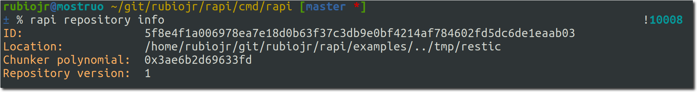
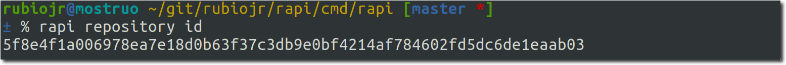
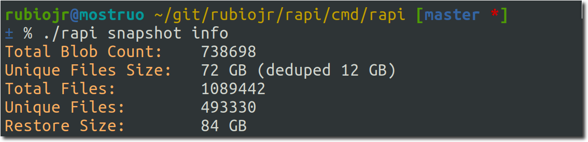

# Restic extras

Extra tools to manage Restic repositories, mostly intended for restic developers and advanced users.

**⚠️ Waring**: these tools are in a experimental state now. Do not use in production repositories.

## Installing the tools

### From source

```
GO111MODULE=on go get github.com/rubiojr/rapi/cmd/rapi
```

### Binaries

No binaries available for the moment.

## Available tools

## repository

### info

    rapi repository info

Prints basic repository information.



### id

    rapi repository id

Prints restic's repository ID.



## snapshots

### info

    rapi snapshot info

Prints basic snapshot information retrieved from the latest available snapshot.



* Total Blob Count: the number of tree and data blobs in the snapshot.
* Unique Files Size: the deduplicated size (in bytes) of the files in the snapshot (the sum of the size of all the blobs).
* Total Files: the total number of files, excluding directories and other special files.
* Unique Files: the total number of files, excluding duplicates.
* Restore Size: the snapshot size after restoring it.

## rescue

### restore-all-versions

    rapi rescue restore-all-versions

Given a pattern, restore all matching files to the target directory.

To restore all files matching `*hello` to `/tmp`:

[](images/rescue-restore-all-versions.png)