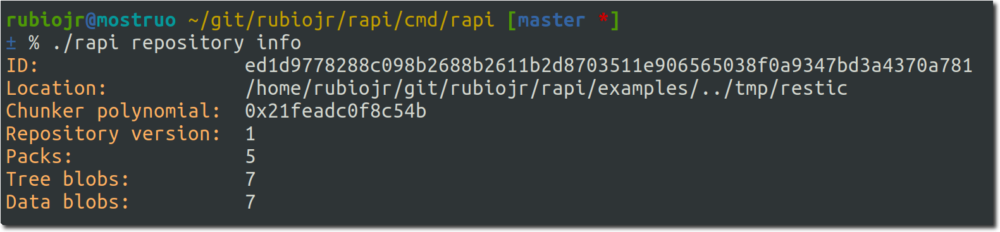
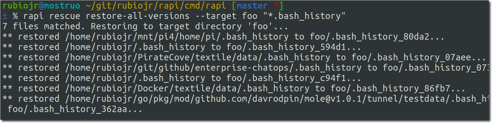

# Restic extras

Extra tools to manage Restic repositories, mostly intended for restic developers and advanced users.

**⚠️ Waring**: these tools are in a experimental state now. Do not use in production repositories.

## Installing the tools

### From source

```
GO111MODULE=on go get github.com/rubiojr/rapi/cmd/rapi
```

Or clone the repository and type:

```
git clone https://github.com/rubiojr/rapi
cd rapi
make
```

### Binaries

No binaries available for the moment.

## Available tools

## repository

### info

    rapi repository info

Prints basic repository information.



### id

    rapi repository id

Prints restic's repository ID.


## snapshots

### info

    rapi snapshot info

Prints basic snapshot information retrieved from the latest available snapshot.


* Total Blob Count: the number of tree and data blobs in the snapshot.
* Unique Files Size: the deduplicated size (in bytes) of the files in the snapshot (the sum of the size of all the blobs).
* Total Files: the total number of files, excluding directories and other special files.
* Unique Files: the total number of files, excluding duplicates.
* Restore Size: the snapshot size after restoring it.

## rescue

### restore-all-versions

    rapi rescue restore-all-versions

Given a pattern, restore all matching files to the target directory.

To restore all files matching `*hello` to `/tmp`:



This will walk all the snapshots available in the repository and restore all the files matching the given pattern (glob pattern, not regular expression) to the target directory.
The file ID (SHA256 sum of the file blobs hashes) is appended to the file name, so if there are multiple versions of the same file, all the versions will be safely restored.

Use cases:

* https://forum.restic.net/t/restore-multiple-file-versions/3196